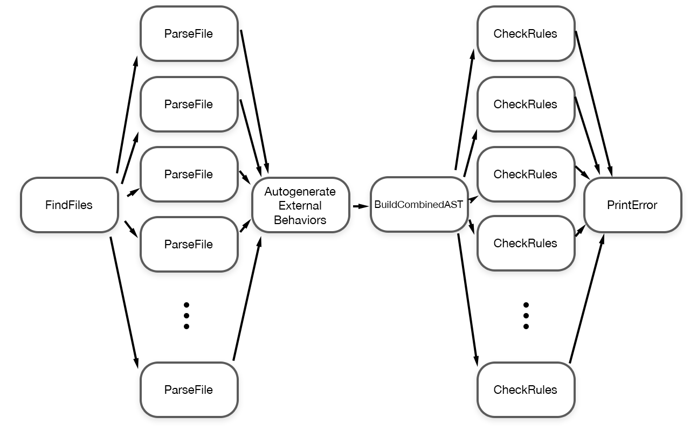

# FlynnLint has been deprecated as it has been integrated into [Flynn as a Swift Package Manager Build Tool](http://github.com/KittyMac/Flynn).


A tool which enforces best practices for safety while using Flynn, the actor-model programming framework for Swift.

FlynnLint is included as a macOS executable in Flynn, and [what it is and how to use is is documented there](https://github.com/KittyMac/flynn/blob/master/docs/FLYNNLINT.md). Generally you don't need to reference this reposity directly, unless you want to build it from source or use in on non-macOS platforms.

## Concurrency in FlynnLint

FlynnLint helps make using Flynn concurrency safe, but in return Flynn helps make FlynnLint fast. FlynnLint uses the Flowable Actor protocol provided by Flynn to chain actors together to form a processing flow for Swift files. It looks something like this:



```swift
pipeline = FindFiles(["swift"]) |>
            AutoCorrectFile() |>
            Array(count: poolSize) { ParseFile() } |>
            BuildCombinedAST() |>
            Array(count: poolSize) { CheckRules(ruleset) } |>
            PrintError { (numErrors: Int) in
                self.numErrors += numErrors
            }
```

Each node in the graph is a Flynn actor.  An actor is and "island of serialization in a sea of concurrency", where an actor processes sequentually but concurrently to all other actors.

**FindFiles** - walks the target directories looking for files ending in ".swift", flows the file path  
**ParseFile** - uses SourceKitten to parse the Swift file into syntax structures, flows a ``FileSyntax`` with this info  
**AutogenerateExternalBehaviors** - checks the file for internal behaviors ( private functions which start with "_be" ) and automatically generates external behaviors if needed  
**BuildCombinedAST** - combines all ``FileSyntax`` together into an ``AST``, which represents the syntax structure of all files in the program; flows individual files + combined AST  
**CheckRules** - Checks the file against the entire ruleset, using file structure and combined AST, flows any errors found  
**PrintError** - Prints the errors to the console, in format appropriate for Xcode error/warning display


This network of actors not only makes the code more modular, the practice performance benefits are real and immediate.  FlynnLint includes some unit tests which benchmarks it against a well-known linter against a corpus of Swift files. As of this writing, FlynnLint lints the corpus about 2x faster (apples-to-oranges comparison, but better than nothing).